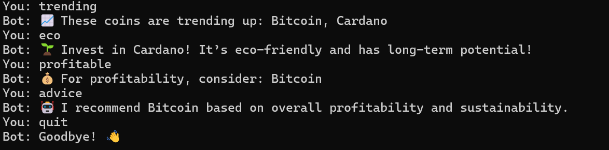

# 🪙 Crypto Query Bot

This is a simple Python-based chatbot that provides insights into cryptocurrency trends, sustainability, and investment recommendations based on a small in-memory database.

## 💡 Features

* 📈 Detects trending coins with rising price trends.
* 🌱 Identifies the most eco-friendly cryptocurrencies.
* 💰 Suggests potentially profitable coins based on market cap and price trend.
* 🤖 Offers smart investment advice by weighing profitability and sustainability.

## 🛠️ Requirements

* Python 3.x

No external libraries are needed.

## 🚀 How to Run

1. Clone this repository or copy the code.
2. Save the code in a Python file, e.g., `crypto_bot.py`.
3. Run the script in your terminal:

```bash
python logic.py
```

4. Interact with the bot by typing questions like:

   * "Which coins are trending?"
   * "Which coin is the most sustainable?"
   * "What’s the best investment?"
   * "Can you recommend a crypto?"

5. Type `exit`, `quit`, or `q` to stop the bot.

## 💬 Sample Interaction

```text
You: Which coins are trending?
Bot: 📈 These coins are trending up: Bitcoin, Cardano

You: Which crypto is eco friendly?
Bot: 🌱 Invest in Cardano! It’s eco-friendly and has long-term potential!

You: Recommend a coin
Bot: 🤖 I recommend Cardano based on overall profitability and sustainability.

You: q
Bot: Goodbye! 👋
```

## 🗼️ Screenshot




## 📄 License

This project is licensed under the MIT License.
